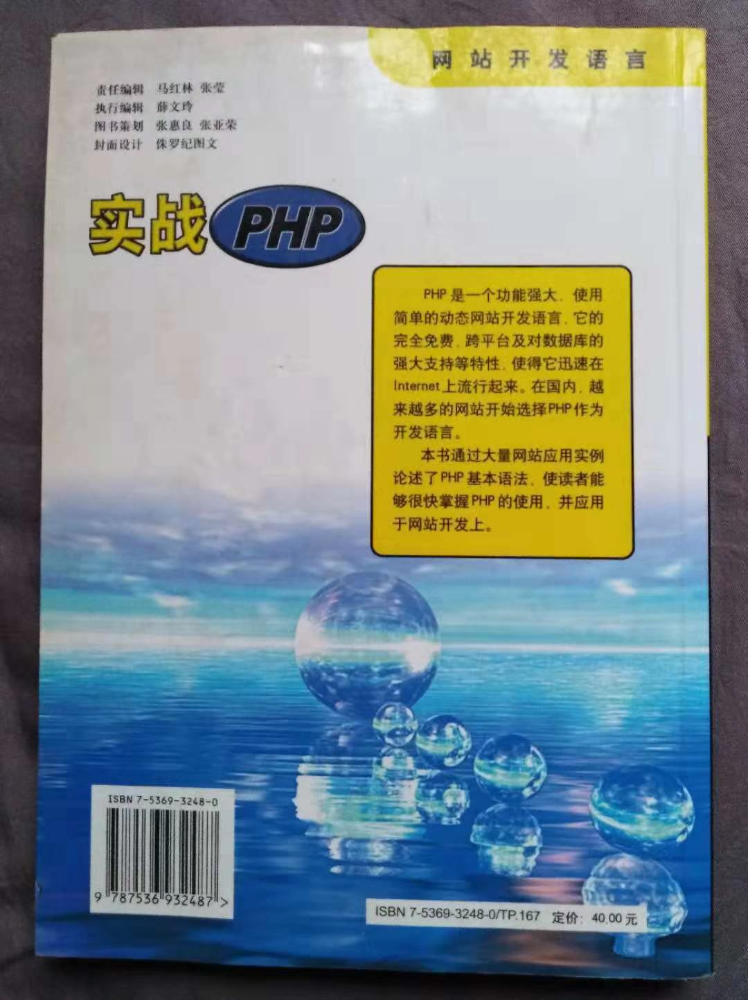

A project under Laravel5.4 framework.

- [Homestead5.4 install in win10](https://mp.weixin.qq.com/s/HEUDUlBhU4SS66oK2EOraw)
- [PhpStorm set up with homestead](http://mp.weixin.qq.com/s/_Cwg4_B6GPR0Xw3t7Bfciw)

- [Homestead5.4 install in win10 at laravel-china.org](https://laravel-china.org/topics/5751/laravel-homestead-win-10-installation-steps-and-precautions)
There is 1218 clicks.

- [PhpStorm set up with homestead](https://laravel-china.org/topics/5826/phpstorm-and-homestead54-development-environment-configuration)
There is 1220 clicks

- [Timestamp Format](http://carbon.nesbot.com/docs)
- [Data Fill](http://github.com/fzaninotto/Faker)
- [Laravel Cheat Sheet](http://cheats.jesse-obrien.ca/)

# My Book

